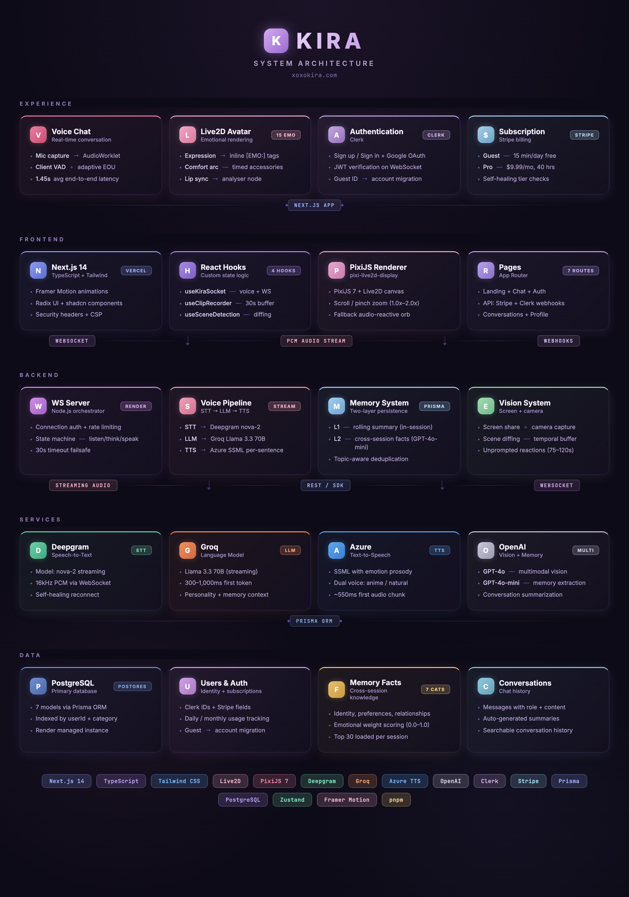

<p align="center">
  
</p>

<h1 align="center">Kira</h1>

<p align="center">
  <strong>Not an assistant. A presence.</strong><br />
  Real-time voice companion with persistent memory, a Live2D avatar, and a personality that actually has opinions.
</p>

<p align="center">
  <a href="https://www.xoxokira.com"><strong>Try it live &rarr;</strong></a>
</p>

<p align="center">
  
  
  
  
  
  
  
  
</p>

---

## What This Is

Kira is a voice-first AI companion you talk to like a person. She listens through your microphone, responds with her own voice, remembers your conversations across sessions, and builds a relationship with you over time.

She has a Live2D avatar that reacts emotionally to what she's saying. She can see your screen or your camera. She teases you, has strong opinions about anime, and will remember that you were stressed about that interview three weeks ago and ask how it went.

Everything is engineered for natural conversation — the first audio plays in under 1.5 seconds, her expressions shift mid-sentence, and she knows when you're pausing to think versus when you've finished talking.

**Live at** [xoxokira.com](https://www.xoxokira.com)

---

## Architecture

<p align="center">
  
</p>

---

## Core Systems

### Voice Pipeline

Audio streams from the browser microphone through an AudioWorklet, across a WebSocket to the server, where Deepgram transcribes it in real-time. An adaptive silence detector determines end-of-utterance — short phrases like "yes" get a 500ms cutoff for snappy responses, while long multi-part questions get up to 1500ms of patience. The transcript routes to Groq's Llama 3.3 70B (streaming), which pipes sentence-by-sentence into Azure TTS. The first sentence of audio arrives at the client while the third sentence is still being written. When vision is active (screen share or camera), the pipeline falls back to OpenAI GPT-4o for multimodal support.

| Metric | Result |
|---|---|
| End-to-end average | 1,450ms |
| End-to-end best | 1,003ms |
| LLM first token | 300–1,000ms |
| TTS first audio | ~550ms |
| Context compression stalls | 0ms (non-blocking) |

### Live2D Avatar

A full Live2D model with 15 emotion states driven by inline LLM expression tags: neutral, happy, excited, love, blush, sad, angry, playful, thinking, speechless, eyeroll, sleepy, frustrated, confused, and surprised. The LLM prefixes every response with an `[EMO:emotion]` tag — parsed from the first streamed tokens and sent to the client before TTS finishes, so her expression shifts as she starts speaking. Optional action and accessory tags (`[EMO:emotion|ACT:action|ACC:accessory]`) trigger contextual animations.

A **comfort arc system** drives timed accessory changes as the conversation progresses — jacket comes off at 1 minute, bangs get clipped at 3.5 minutes, earbuds go in at 7.5 minutes. Late night sessions (10pm–4am) start with the jacket already off. Accessories persist through emotion changes and expression resets.

### Memory

Memory operates on two layers:

**Layer 1 — In-conversation.** A rolling summary compresses older messages in the background without blocking the response pipeline. When chat history exceeds 20 messages, the 6 oldest are spliced out and summarized asynchronously. A 20-minute conversation retains full context from the first minute.

**Layer 2 — Cross-session.** On disconnect, an extraction pipeline sends the conversation to GPT-4o-mini and stores structured facts in a `MemoryFact` table across 7 categories — identity, preferences, relationships, emotional patterns, shared experiences, life context, and opinions — each weighted by emotional significance (0.0–1.0). On reconnect, the top 30 facts by weight are loaded into context with natural-language framing so Kira references them like a friend, not a database.

**Deduplication** uses topic-aware matching — a fact about a user's favorite anime won't replace a fact about their favorite food just because both contain the word "favorite."

### Vision

**Screen share (desktop):** Captured via `getDisplayMedia`, downscaled to 512px, sent as JPEG snapshots with a scene-change detection system and rolling temporal buffer — Kira sees not just the current frame but a timeline of recent changes.

**Camera (mobile):** Rear or front camera via `getUserMedia` with tap-to-flip and draggable PIP preview. Same snapshot pipeline.

Both modes send periodic captures every 15 seconds plus speech-triggered snapshots. Up to 3 frames per LLM call for temporal context. An independent reaction timer fires every 75–120 seconds so Kira comments on what she sees unprompted.

### Dual Voice System

Two Azure TTS voice configurations switchable mid-conversation:

- **Anime** — Higher pitch, faster rate, expressive style. Default.
- **Natural** — Softer, slower, conversational tone.

### Clip & Share

A rolling 30-second MediaRecorder buffer captures the avatar canvas composited with the scene background and Kira's audio output. Save as MP4 or share via Web Share API on mobile.

---

## User Tiers

| | Guest | Free (signed in) | Pro — $9.99/mo |
|---|---|---|---|
| Real-time voice | ✓ | ✓ | ✓ |
| Live2D avatar + expressions | ✓ | ✓ | ✓ |
| Vision (screen share / camera) | ✓ | ✓ | ✓ |
| In-conversation memory | ✓ | ✓ | ✓ |
| Cross-session memory | — | ✓ | ✓ |
| Conversation history | — | ✓ | ✓ |
| Daily limit | 15 min | 15 min | 40 hrs/mo |

Guest conversations are buffered in-memory for 24 hours. If a guest creates an account, their conversation and extracted memories are automatically migrated via a Clerk webhook.

---

## Tech Stack

| Layer | Technology | Purpose |
|---|---|---|
| **Frontend** | Next.js 14, React 18, Tailwind CSS | App shell, routing, UI |
| **Avatar** | PixiJS 7, pixi-live2d-display | Live2D rendering, 15 emotions |
| **Animation** | Framer Motion | Page transitions, UI animations |
| **State** | Zustand | Client state management |
| **Voice Server** | Node.js, ws | WebSocket pipeline orchestration |
| **Speech-to-Text** | Deepgram (nova-2) | Real-time streaming STT |
| **Language Model** | Groq Llama 3.3 70B | Conversation (streaming) |
| **Vision Model** | OpenAI GPT-4o | Multimodal vision fallback |
| **Memory Model** | OpenAI GPT-4o-mini | Fact extraction + summarization |
| **Text-to-Speech** | Azure Cognitive Services | SSML synthesis, dual voice |
| **Auth** | Clerk | JWT, webhooks, guest migration |
| **Billing** | Stripe | Checkout, portal, subscription lifecycle |
| **Database** | PostgreSQL + Prisma ORM | 7 models, indexed queries |
| **Hosting** | Vercel (web) + Render (server) | Edge frontend + managed backend |

---

## Project Structure

```
Kira_App/
├── packages/
│   ├── web/                                 # Next.js frontend (Vercel)
│   │   ├── src/
│   │   │   ├── app/
│   │   │   │   ├── api/
│   │   │   │   │   ├── stripe/                 # Checkout + billing portal
│   │   │   │   │   ├── webhooks/               # Stripe + Clerk webhook handlers
│   │   │   │   │   ├── conversations/           # Conversation history API
│   │   │   │   │   └── user/                    # Account deletion
│   │   │   │   ├── (auth)/                      # Clerk sign-in / sign-up
│   │   │   │   └── (chat)/
│   │   │   │       └── chat/[conversationId]/
│   │   │   │           └── ChatClient.tsx       # Main chat UI + scene + clip
│   │   │   ├── components/
│   │   │   │   ├── Live2DAvatar.tsx             # Avatar rendering + 15 expressions
│   │   │   │   ├── ConversationHistory.tsx      # Sidebar + search
│   │   │   │   ├── ChibiLoader.tsx              # Loading screen
│   │   │   │   ├── KiraOrb.tsx                  # Fallback audio visualizer
│   │   │   │   └── ProfileModal.tsx             # User settings
│   │   │   ├── hooks/
│   │   │   │   ├── useKiraSocket.ts             # WebSocket + VAD + adaptive EOU
│   │   │   │   ├── useClipRecorder.ts           # Rolling 30s clip buffer + share
│   │   │   │   ├── useSceneDetection.ts         # Screen share scene diffing
│   │   │   │   └── use-subscription.ts          # Stripe subscription check
│   │   │   └── lib/
│   │   │       ├── prisma.ts                    # Singleton Prisma client
│   │   │       ├── stripe.ts                    # Stripe client init
│   │   │       ├── guestId.ts                   # localStorage guest ID
│   │   │       ├── LipSyncEngine.ts             # Analyser node for lip sync
│   │   │       └── voicePreference.ts           # Voice selection persistence
│   │   ├── public/
│   │   │   └── worklets/models/
│   │   │       ├── Kira/                        # Live2D model assets
│   │   │       └── Suki/                        # Scene videos + chibi art
│   │   ├── middleware.ts                        # Clerk auth middleware
│   │   └── next.config.js                       # Security headers + cache
│   │
│   └── server/                              # Real-time voice server (Render)
│       └── src/
│           ├── server.ts                        # Pipeline orchestration + state machine
│           ├── personality.ts                   # Kira's character system prompt
│           ├── memoryExtractor.ts               # Post-conversation fact extraction
│           ├── memoryLoader.ts                  # Memory loading on connect
│           ├── guestMemoryBuffer.ts             # Guest conversation continuity
│           ├── guestUsage.ts                    # Guest daily usage (Prisma)
│           ├── proUsage.ts                      # Pro monthly usage (Prisma)
│           ├── prismaClient.ts                  # Shared Prisma instance
│           ├── DeepgramSTTStreamer.ts            # STT with self-healing reconnect
│           └── AzureTTSStreamer.ts               # SSML synthesis (dual voice)
│
├── prisma/
│   └── schema.prisma                            # User, Conversation, Message,
│                                                # MemoryFact, MonthlyUsage, GuestUsage
├── packages/docs/
│   ├── architecture.html                        # Architecture diagram (source)
│   └── architecture.png                         # Architecture diagram (rendered)
└── render.yaml                                  # Render deployment config
```

---

## Run Locally

```bash
git clone https://github.com/JonathanDunkleberger/Kira_App.git
cd Kira_App
pnpm install
```

Copy `.env.example` to `.env` in both `packages/web/` and `packages/server/`. Required keys:

```
# Server
CLERK_SECRET_KEY, OPENAI_API_KEY, GROQ_API_KEY,
DEEPGRAM_API_KEY, AZURE_SPEECH_KEY, AZURE_SPEECH_REGION,
STRIPE_SECRET_KEY, INTERNAL_API_SECRET, DATABASE_URL

# Web
NEXT_PUBLIC_APP_URL, NEXT_PUBLIC_WEBSOCKET_URL,
STRIPE_SECRET_KEY, STRIPE_PRICE_ID, STRIPE_WEBHOOK_SECRET,
CLERK_WEBHOOK_SECRET
```

```bash
pnpm dev:web      # localhost:3000
pnpm dev:server   # ws://localhost:10000
```

See [`DEPLOYMENT.md`](./DEPLOYMENT.md) for Vercel + Render deployment.

---

## Security

The application has been through a comprehensive security audit covering authentication, WebSocket hardening, payment flow, and infrastructure:

- Clerk JWT verification on all WebSocket connections with guest ID format validation
- WebSocket origin allowlist and 5MB max payload
- Per-connection LLM call rate limiting and control message throttling
- Per-IP connection limits
- Stripe webhook signature verification with subscription lifecycle handling
- CSRF protection on payment routes
- Security headers (X-Frame-Options, CSP, HSTS via hosting)
- No API keys or secrets exposed to the client

---

## License

MIT — see [LICENSE](./LICENSE).
