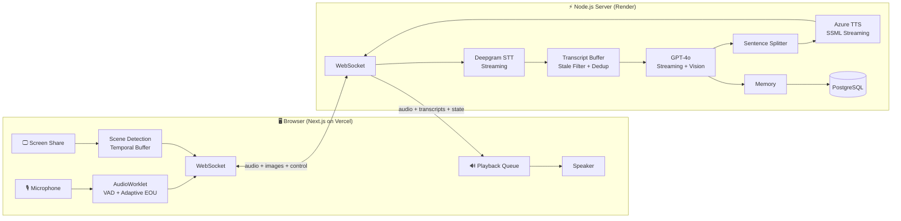

# ✨ Kira AI — Voice-First AI Media Companion


**An AI you talk to while watching, gaming, or reading — hands free, in real time.**

Kira is a voice AI companion built for media consumption. You speak, she listens. She can see your screen, remember what you talked about last week, and hold a natural conversation without you ever touching your keyboard.

🔗 **Try it live:** [xoxokira.com](https://www.xoxokira.com)

---

## 🎯 What It Does

You're watching *Garden of Words* and want to talk about it without pausing. You say "Have you seen this? What do you think about the animation?" and Kira responds conversationally — she can see your screen, knows what you're watching, and remembers that you love Makoto Shinkai films from a conversation two weeks ago.

The experience is built around a simple idea: **the best companion for media doesn't compete with it for your hands or your eyes.** Voice-in, voice-out, always listening, always watching alongside you.

---

## 🧠 How It Works

Not a wrapper around a single API — it's a full real-time system where every component operates under tight latency constraints:

**Streaming voice pipeline** — Microphone audio flows through a client-side AudioWorklet, streams to Deepgram for real-time transcription, routes through GPT-4o for a response, then streams sentence-by-sentence through Azure TTS back to your speakers. Every stage operates incrementally so nothing waits for anything else to finish. The first sentence of a response plays while the third is still being written.

**Adaptive conversation timing** — The hardest UX problem in voice AI is knowing when someone has stopped talking. Say "yes" and you want an instant response. Ask a long philosophical question with a thinking pause in the middle and you don't want to get cut off. The adaptive silence detector scales its patience based on how long you've been speaking — fast for short replies, patient for complex thoughts.

**Vision system** — Screen share frames run through a scene-change detection algorithm that maintains a rolling buffer of visual context. When you speak, Kira receives not just a single screenshot but a timeline of the last 3 scene changes plus the current frame — so she can answer "what just happened?" not just "what's on screen right now?"

**Self-healing connections** — Third-party WebSocket connections die silently during long sessions. No error, no close event — they just stop producing data. Health monitoring detects when the speech-to-text stream has gone quiet and automatically tears down and re-establishes the connection transparently.

**Persistent memory** — Conversations are summarized and stored. When you come back tomorrow, Kira remembers your name, your taste in anime, and that you were on episode 3 of something last time.

---

## 🏗️ Architecture



---

## 🛠️ Tech Stack

| Layer | Technology |
|:------|:-----------|
| Frontend | Next.js 14, React 18, Tailwind CSS, Vercel |
| Realtime Server | Node.js, `ws`, custom streaming orchestration |
| Speech-to-Text | Deepgram (live WebSocket) |
| Language Model | OpenAI GPT-4o (streaming + tool use + vision) |
| Text-to-Speech | Azure Cognitive Services (per-sentence SSML) |
| Vision | `getDisplayMedia` + canvas scene diffing → GPT-4o |
| Auth & Billing | Clerk + Stripe |
| Database | Supabase (PostgreSQL) + Prisma ORM |

---

## 📂 Project Structure

```
ai-media-companion/
├── packages/
│   ├── web/                        # Next.js frontend
│   │   ├── src/hooks/
│   │   │   ├── useKiraSocket.ts        # WebSocket + VAD + adaptive EOU
│   │   │   └── useSceneDetection.ts    # Screen share scene diffing
│   │   └── public/worklets/
│   │       └── AudioWorkletProcessor.js
│   │
│   └── server/                     # Realtime voice server
│       └── src/
│           ├── server.ts               # Pipeline orchestration
│           ├── DeepgramSTTStreamer.ts   # STT with self-healing
│           └── AzureTTSStreamer.ts      # SSML synthesis
│
└── prisma/                         # Shared schema + migrations
```

---

## 🚀 Run It Yourself

```bash
git clone https://github.com/JonathanDunkleberger/Kira_AI_2.git
cd Kira_AI_2/ai-media-companion
pnpm install
```

Create `.env.local` files at root and in `packages/server/` — see the `.env.example` files for what's needed.

```bash
pnpm dev:web      # → http://localhost:3000
pnpm dev:server   # → ws://localhost:10000
```

Deployment details (Vercel + Render setup) are in [`DEPLOY.md`](./DEPLOY.md).

---

## 📄 License

MIT
