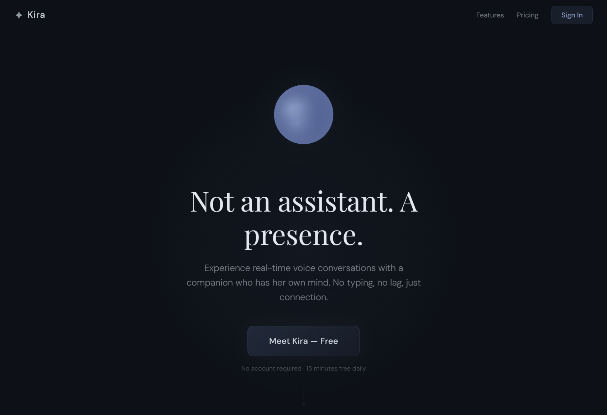

# Kira — Copy Revisions v2 (Consolidated)



This replaces the previous copy revisions doc. Reflects all decisions
made including the "Not an assistant. A presence." pivot, 3-card feature
grid, Garden of Words subline, and stats bar update.

All changes are string replacements unless noted. No layout changes
except the feature grid going from 6 cards to 3.

---

## 1. Hero Section — Headline

**Find:**
```
An AI companion that actually remembers you.
```

**Replace with:**
```
Not an assistant. A presence.
```

---

## 2. Hero Section — Subline

**Find:**
```
Real-time voice conversations with persistent memory.
She knows your name, your stories, and picks up right where you left off.
```

**Replace with:**
```
Experience real-time voice conversations with a companion who has
her own mind. No typing, no lag, just connection.
```

---

## 3. Hero Section — CTA Button

**Find:**
```
Talk to Kira — free
```

**Replace with:**
```
Meet Kira — Free
```

---

## 4. Hero Section — Micro-copy Under Button

**Find:**
```
No account required · 15 minutes free daily
```

**Replace with:**
```
No account required · 15 minutes free daily
```

(No change — keep as-is.)

---

## 5. Stats Bar

**Find the three stats and replace the entire array:**

```javascript
// OLD:
{ value: <Counter end={500} suffix="ms" />, label: "avg response time" },
{ value: "24/7", label: "always available" },
{ value: <Counter end={100} suffix="%" />, label: "conversation recall" },
```

**Replace with:**
```javascript
{ value: <Counter end={500} suffix="ms" />, label: "avg response time" },
{ value: "24/7", label: "always available" },
{ value: <Counter end={7} />, label: "dimensions of memory" },
```

---

## 6. Features Section — Header

**Find:**
```
Not a chatbot. A companion.
```
(or whatever the current version is — may be "A relationship." or "She has her own mind.")

**Replace with:**
```
What makes her feel real.
```

---

## 7. Features Section — Subline

**Find the current subline** (whatever is below the features header) **and replace with:**

```
You're watching Garden of Words at 1am and you want to talk about
the animation without pausing. You say it out loud. She responds —
and she already knows you love Makoto Shinkai from a conversation
two weeks ago. That's the experience we built for.
```

---

## 8. Feature Grid — Collapse from 6 Cards to 3

Remove all 6 existing feature cards. Replace with exactly 3:

**Card 1:**
- Icon: sparkle/personality (keep existing SVG badge style)
- Title: "Dynamic Personality"
- Body: "She isn't neutral. She has opinions, moods, and a sense of humor that evolves as you talk."

**Card 2:**
- Icon: brain/memory (keep existing SVG badge style)
- Title: "Associative Memory"
- Body: "She doesn't just store facts; she connects the dots. If you mention your boss, she remembers how you felt about him last week."

**Card 3:**
- Icon: mic/waveform (keep existing SVG badge style)
- Title: "Real-Time Flow"
- Body: "Interrupt anytime. The sub-300ms response time means you never have to wait for her to 'think'."

Keep the same card styling (rounded-square icon badges, gradient backgrounds,
border treatment). Just fewer cards, centered in a row of 3.

---

## 9. Conversation Example — Section Title

**Find:**
```
What talking to Kira sounds like.
```

**Replace with:**
```
What six months with Kira sounds like.
```

---

## 10. Conversation Example — Dialogue

**Replace the entire conversation array with:**

```javascript
{ role: "user", text: "I think I'm actually going to apply for that design lead role." },
{ role: "ai", text: "Wait, seriously? Six months ago you told me you never wanted to manage people. What changed?" },
{ role: "user", text: "I don't know, I guess I grew into it." },
{ role: "ai", text: "I mean, you did completely turn that project around last quarter. And you've been mentoring Jake for like two months now even though nobody asked you to. I think you've been a lead for a while, you just didn't have the title." },
```

---

## 11. Final CTA — Subline

**Find:**
```
No signup required. Just click and start talking.
```

**Replace with:**
```
No signup required. Start talking and she'll start learning.
```

---

## 12. Paywall — Guest Headline

**Find:**
```
Kira will remember this conversation.
```

**Replace with:**
```
This is the beginning of something.
```

---

## 13. Paywall — Guest Body Text

**Find:**
```
Create a free account and she'll remember your name, your stories,
and everything you talked about — next time and every time after.
```

**Replace with:**
```
Create a free account and Kira keeps building on everything you
just talked about — and every conversation after.
```

---

## 14. Ticker / Social Proof Bar (if adding)

If adding a ticker below the hero (separate from the stats bar), use:

```
Powered by GPT-4o-mini · <300ms Latency · AES-256 Encryption
```

NOTE: Only include AES-256 claim if verified for your WebSocket (wss://)
and database (Supabase encrypts at rest by default — confirm).

---

## Summary

| # | Location | Change | Reason |
|---|----------|--------|--------|
| 1 | Hero headline | "remembers you" → "Not an assistant. A presence." | New positioning |
| 2 | Hero subline | "knows your name" → "companion who has her own mind" | Personality > recall |
| 3 | Hero CTA | "Talk to" → "Meet" | Warmer, more personal |
| 4 | Hero micro-copy | No change | Already good |
| 5 | Stats bar | "100% recall" → "7 dimensions of memory" | Real metric, differentiator |
| 6 | Features header | "Not a chatbot" → "What makes her feel real." | No echo of hero |
| 7 | Features subline | Generic → Garden of Words example | Shows genuine passion, demonstrates product |
| 8 | Feature grid | 6 cards → 3 focused cards | Cleaner, more confident |
| 9 | Example title | "sounds like" → "six months sounds like" | Sells the relationship arc |
| 10 | Example dialogue | Interview anxiety → career growth synthesis | Shows deep memory + understanding |
| 11 | Final CTA | "start talking" → "she'll start learning" | First convo = beginning |
| 12 | Paywall headline | "will remember" → "beginning of something" | Emotional, forward-looking |
| 13 | Paywall body | "remember your name" → "keeps building" | Accumulation, not storage |

All changes are copy-only except #8 (feature grid goes from 6 to 3 cards).
