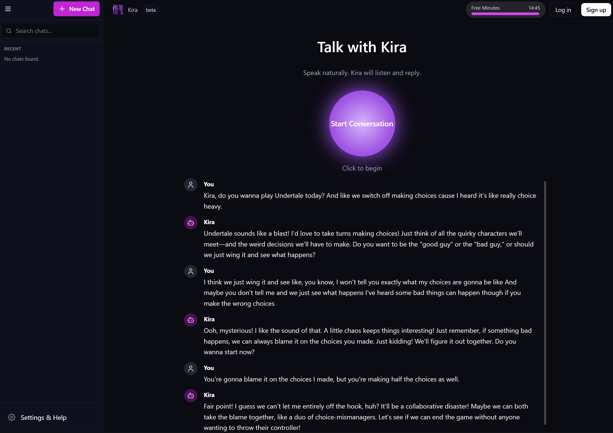

# ✨ Kira AI — The Web‑Based Media Companion

Your voice‑first AI companion, re‑imagined for the web.

Live Demo: [kira-ai-2.vercel.app](https://kira-ai-2.vercel.app)

<!-- Demo screenshot -->



---

## 🚀 From Desktop Hobby Project to Scalable SaaS

This project is the professional, web-based evolution of the original open-source Kira AI VTuber, a Python-based desktop application.

The goal was to take the core concept of a voice‑first AI companion and re‑architect it as a scalable, accessible, and commercially viable SaaS. By moving to a web‑native stack, Kira becomes a seamless, browser‑based experience.

---

## 🎯 Key Features

- 🎙️ Seamless voice conversations: Voice Activity Detection (VAD) lets you just start talking—no push‑to‑talk.
- ⏱️ Server‑authoritative usage & limits: Heartbeat accrual (every few seconds) updates daily + per‑chat usage; no client drift.
- 📈 Freemium SaaS: Guest, Free, and Pro plans with Stripe subscriptions & upgrade nudges.
- 🧠 Persistent memory (Pro): Long‑term memory context for more personalized replies.
- 🌐 100% web‑based: Nothing to install; works in modern Chromium browsers.
- 🔐 Secure & private: Supabase Auth, RLS, per‑user chat history APIs.

### Unified Limit Dialog

A single `LimitDialog` component presents both daily free paywall and per‑chat cap limits. It subscribes to heartbeat payloads (`t: 'heartbeat'`) via a lightweight global callback `(window as any).__onHeartbeat(msg)` triggered after the usage store updates. This keeps enforcement server‑side while ensuring consistent, minimal UI.

```tsx
// Example wrapper
<ChatGuardrails>
  <YourChatUI />
</ChatGuardrails>
```

---

## 🛠️ Tech Stack & Architecture

Modern web architecture with a dedicated real‑time voice server. Business logic (entitlements, usage, plans) is server‑authoritative; the UI uses centralized state for predictability.

| Category                  | Technology                                                          |
| ------------------------- | ------------------------------------------------------------------- |
| Frontend                  | Next.js, React, Tailwind CSS, Framer Motion                         |
| Voice backend (real‑time) | Node WebSocket server (ws) on Render                                |
| App APIs                  | Next.js API Routes (Vercel or any Node host)                        |
| Database                  | Supabase (Postgres), Supabase Auth, Row‑Level Security              |
| AI                        | Whisper (STT), OpenAI Chat Completions (LLM), Azure TTS (streaming) |
| Payments                  | Stripe Checkout & Webhooks                                          |

---

## 🏆 Highlights & Engineering Challenges

- Heartbeat usage accrual: Server ticks entitlements & emits authoritative snapshots (eliminates race/drift).
- Entitlements schema: `user_entitlements`, `daily_usage`, `chat_sessions` plus RPC for atomic increments.
- Frictionless conversion funnel: Guest → signup → resume chat, upgrade surfaces when limits near.
- Guardrails UX: Unified LimitDialog handles both paywall and per‑chat cap states (one component, two modes).
- Polished UX: Dynamic voice orb (Web Audio API), tuned VAD, streaming TTS for rapid first phoneme.

---

## 🔑 Environment Setup

This project uses environment variables. Use `.env.example` as a template and copy to `.env.local`.

Required categories:

- Supabase URL & keys
- Stripe API & webhook secret
- OpenAI & Azure API keys
- Public app URL & free‑trial configuration
- WebSocket URL(s) for the voice server

Key client/server vars (non‑exhaustive):

- `NEXT_PUBLIC_WEBSOCKET_URL` (e.g. ws://localhost:8080 for dev)
- `OPENAI_API_KEY`, `OPENAI_MODEL`
- `SUPABASE_URL`, `SUPABASE_ANON_KEY` (client)
- `SUPABASE_SERVICE_ROLE_KEY` (server only)
- `AZURE_*` for TTS (if using Azure provider)
- `TTS_PROVIDER` ("azure" | "elevenlabs") defaults to azure
- `ELEVENLABS_API_KEY`, `ELEVENLABS_VOICE_ID` (if using ElevenLabs fallback)
- `FREE_TRIAL_SECONDS`, `FREE_DAILY_LIMIT`, `PRO_CHAT_SESSION_LIMIT` (usage tuning)
- Clerk Auth:
  - `CLERK_PUBLISHABLE_KEY`
  - `CLERK_SECRET_KEY`
  - `CLERK_WEBHOOK_SECRET` (for user sync route)

## Backend Data Flow (Phase 1 One-Shot Plan)

This phase introduces Prisma-backed persistence for core objects while retaining existing Supabase-based endpoints during a short transition window:

1. ensureUser(): called in new Prisma conversation/message endpoints to mirror Clerk users into the relational store.
2. Conversations: `POST /api/conversations` (Prisma) creates row; existing Supabase conversation endpoints will be deprecated.
3. Messages: future `POST /api/conversations/[id]/messages` route to append user/ai messages as they stream.
4. Usage tracking: after a session ends, total seconds are aggregated into `Usage` (daily roll-up per user).
5. Migration strategy: initial Prisma migration applied via `prisma migrate deploy` against the production Supabase PostgreSQL instance.

During the cutover, UI calls will be updated incrementally to point from Supabase REST endpoints to the new Prisma-backed routes.

### New Prisma Endpoints

All conversation/message operations now backed by Prisma tables (`app_conversations`, `app_messages`, `app_users`). Response shape maintains legacy keys (`created_at`, `updated_at`) for UI compatibility.

| Endpoint                           | Method | Description                    |
| ---------------------------------- | ------ | ------------------------------ |
| `/api/conversations`               | GET    | List user conversations        |
| `/api/conversations`               | POST   | Create new conversation        |
| `/api/conversations/[id]`          | PATCH  | Rename conversation            |
| `/api/conversations/[id]`          | DELETE | Delete conversation            |
| `/api/conversations/[id]/messages` | GET    | List messages (ascending)      |
| `/api/conversations/[id]/messages` | POST   | Append message (text + sender) |

Auth: Clerk user required (guest flow deferred). `ensureUser()` upserts into `app_users`.

- Database:
  - `DATABASE_URL` (Postgres for Prisma)

### Unified Usage Tracking (Users & Guests)

Daily usage seconds are persisted in the Prisma `Usage` model (`app_usage`). Authenticated users aggregate by `userId`. Guest users (no Clerk session) are aggregated by their IP address (from `x-forwarded-for` or `x-real-ip`).

Endpoints (all dynamic – no caching):

| Endpoint            | Method | Purpose                                 | Identity Strategy    |
| ------------------- | ------ | --------------------------------------- | -------------------- |
| `/api/usage`        | GET    | Backwards-compatible usage fetch        | UserId → IP fallback |
| `/api/usage`        | POST   | Backwards-compatible update (increment) | UserId → IP fallback |
| `/api/usage/check`  | GET    | Explicit usage snapshot                 | UserId → IP fallback |
| `/api/usage/update` | POST   | Explicit usage increment                | UserId → IP fallback |

Request (POST /api/usage/update or /api/usage):

```json
{ "secondsUsed": 5 }
```

Response shape (all routes):

```json
{
  "secondsRemaining": 123,
  "dailyLimitSeconds": 900,
  "subject": "user" | "ip"
}
```

Implementation details:

1. `userId` nullable & new `ip` column with indices for efficient day-range aggregation.
2. Helper functions accept `{ userId }` or `{ ip }` identity object.
3. Daily window: UTC day `[00:00, 24:00)`. Adjust if you later need locale-based rollover.
4. Abuse considerations: IP-based limiting is coarse; consider adding lightweight cookie or signed fingerprint to reduce NAT collisions. Rate-limit bursts per IP if necessary.
5. Migration name: `guest_usage_ip` (adds nullable userId, ip column, indices).

Environment knobs:

| Var                  | Meaning                                                          |
| -------------------- | ---------------------------------------------------------------- |
| `FREE_TRIAL_SECONDS` | Daily allowance applied to both authenticated and guest subjects |

Future hardening ideas (not yet implemented):

- Add soft session-bound accrual (conversation-level) for more granular gating.
- Introduce HMAC-signed client fingerprint combining UA + coarse IP for better uniqueness.
- Periodic cleanup task to prune stale guest IP rows (older than 30 days) to keep table lean.

#### Realtime Enforcement

Before processing audio, the voice WebSocket server calls `/api/usage/check`. If `secondsRemaining <= 0` it sends:

```json
{
  "t": "limit_exceeded",
  "reason": "daily_limit",
  "message": "Daily free usage exhausted. Upgrade to continue."
}
```

The client (`useVoiceSocket`) listens for this event, sets a global flag, and a lightweight `LimitBanner` component displays an upgrade prompt. This ensures no additional audio is processed post-limit.

### Streaming TTS Protocol

When a final transcript is produced:

1. Server emits `{ t: 'transcript', text }`.
2. Server generates LLM reply (history aware) then streams Azure TTS:

- `{ t: 'tts_start' }`
- Repeated `{ t: 'tts_chunk', b64: <base64 audio frame> }` (WebM Opus 24k mono)
- `{ t: 'tts_end' }`

Clients accumulate frames; large buffers flush early to reduce latency. Legacy `{ t: 'tts_url' }` messages still supported for non-streaming paths.

### Realtime Speech Recognition (Deepgram)

Add `DEEPGRAM_API_KEY` to enable production streaming STT (model `nova-2`).

Client sends `audio/webm;codecs=opus` 48k mono chunks; server opens a Deepgram websocket with matching params (`encoding=opus&sample_rate=48000&channels=1`). Partial transcripts are emitted with `{ t: 'partial' }`, finals as `{ t: 'transcript' }` followed by assistant reply `{ t: 'speak' }`.

If the key is absent the server falls back to a lightweight mock transcriber so voice flow still works locally without external spend.

Partial Captions: While you speak, interim hypotheses stream in and render as a faint italic line at the bottom of the conversation (`partialStore`). They are cleared when a final transcript arrives or when the assistant begins speaking.

Auto-Retry: The Deepgram websocket now reconnects with exponential backoff (500ms doubling, capped at 8s) if the connection drops mid‑session. Audio chunks are queued while reconnecting; if reconnection fails they are discarded when the transcriber closes.

Environment only (never expose to browser):

```bash
DEEPGRAM_API_KEY=dg_secret_...
```

Future overrides (not yet parameterized): `model`, `tier`, `smart_format`, `punctuate`.

### TTS Provider Switching

By default Azure TTS is used. To switch to ElevenLabs, set:

```bash
TTS_PROVIDER=elevenlabs
ELEVENLABS_API_KEY=sk_your_key
ELEVENLABS_VOICE_ID=21m00Tcm4TlvDq8ikWAM # or preferred voice
```

If unset or invalid, Azure remains the default (requires `AZURE_SPEECH_KEY`, `AZURE_SPEECH_REGION`). The streaming helper currently streams only Azure; ElevenLabs path buffers full audio then emits a single chunk (upgrade: integrate official streaming endpoint later).

---

## ⏯️ Getting Started (Local)

1. Copy environment template and fill values

```bash
cp .env.example .env.local
```

1. Install dependencies and run both Next.js and the voice WS server

```bash
npm install
npm run dev
```

The app runs at [http://localhost:3000](http://localhost:3000)

Notes:

- `npm run dev` runs Next (port 3000) + WebSocket server (port 8080) concurrently.
- Set `NEXT_PUBLIC_WEBSOCKET_URL=ws://localhost:8080` in `.env.local`.
- WS server: `/healthz` for liveness; requires Supabase auth token via `?token=` (attached automatically). Active chat session id via `?conversationId=`.
- Heartbeat: server emits usage every ~5s; client store interpolates elapsed seconds for smooth UI.

---

## 🧪 Testing

Basic Playwright scaffolding is included. Microphone permissions are granted in `playwright.config.ts`.

```bash
npx playwright test
```

---

## 📦 Build & Deploy

- Frontend (Next.js)
  - Build: `npm run build`
  - Host on Vercel or any Node host.

- Voice server (WebSocket on Render)
  - Build: `npm run build:server`
  - Start: `npm run start:server` (runs `dist/socket-server.js`)
  - Render deployment supported via `render.yaml` (binds to `PORT`, exposes `/healthz`).

## 🤝 Contributing

Contributions welcome! Ways to help:

1. Open an issue for bugs, DX papercuts, or enhancement ideas.
2. Submit a PR (small, focused changes preferred). Include context in the description.
3. Improve docs: clearer env var explanations, architecture diagrams, or onboarding notes.

Guidelines:

- Run `npm run typecheck && npm test && npm run lint` before opening a PR.
- Keep commits scoped; squash or rebase noisy fixups.
- Avoid introducing breaking env vars without documenting them in `.env.example`.

If you're unsure whether a feature fits, open an issue for discussion first.

## 📄 License

Released under the MIT License – see `LICENSE`.

## 📝 Notes

- Realtime pipeline: STT → limited history fetch → LLM response streaming → TTS stream → client playback.
- Heartbeat authoritative usage prevents client spoofing & clock drift.
- All timers in UI are display-only; enforcement lives server-side.

### 2025-09 Voice Socket Consolidation

Legacy `lib/useVoiceSocket.ts` (singleton helpers) was removed. Unified access lives in `lib/voice.ts`, which wraps the newer hook-based implementation in `lib/hooks/useVoiceSocket.ts` while presenting the familiar API (`connectVoice`, `startMic`, `stopMicForUtterance`, `endCall`, `sendJson`, `setMuted`). Extend `lib/voice.ts` if additional surface area is required instead of recreating parallel socket modules.
