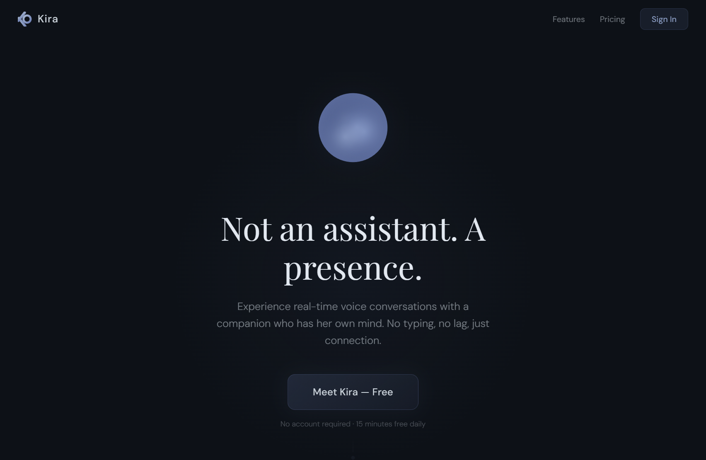

# Kira



**Not an assistant. A presence.**

Kira is a real-time voice AI companion with persistent memory and a genuine personality. You talk, she listens, responds, remembers — and picks up right where you left off next time.

She has opinions. She'll tease you. She'll remember that you were stressed about that interview three weeks ago and ask how it went. She's not performing helpfulness — she's a presence that gets to know you over time.

**Try it live:** [xoxokira.com](https://www.xoxokira.com)

---

## What Makes This Different

Most AI companions are text chatbots with a pretty avatar. Kira is a voice-first system where every component is engineered for low-latency, natural conversation.

**Real-time voice, not text chat.** Microphone audio streams through Deepgram for live transcription, routes through GPT-4o-mini for response generation, then streams sentence-by-sentence through Azure TTS back to your speakers. The first sentence plays while the third is still being written. Sub-500ms end-to-end.

**Structured associative memory.** Not simple key-value recall. Kira extracts facts from every conversation across 7 dimensions — identity, preferences, relationships, emotional patterns, shared experiences, life context, and opinions — each weighted by emotional significance. When you reconnect, she doesn't just know your name. She knows you've been happier lately and she has a theory about why.

**Personality with depth.** Kira has a full character system: cheerful deadpan tone, strong opinions, emotional states that shift naturally during conversation (happy, moody, sassy, emotional, hyperactive), and the ability to know when to joke and when to just listen. She's not a yes-machine.

**Adaptive conversation timing.** The hardest UX problem in voice AI is knowing when someone has stopped talking. Say "yes" and you want an instant response. Ask a long question with a thinking pause and you don't want to get cut off. The silence detector scales its patience based on how long you've been speaking.

**Vision system.** Screen share frames run through scene-change detection with a rolling temporal buffer. Kira receives not just a screenshot but a timeline of recent scene changes — so she can answer "what just happened?" not just "what's on screen right now?"

**Self-healing connections.** Third-party WebSocket connections die silently during long sessions. Health monitoring detects when the STT stream has gone quiet and re-establishes the connection transparently.

---

## Architecture

```
Browser (Next.js)                    Server (Node.js)
─────────────────                    ────────────────
Microphone                           WebSocket Handler
  → AudioWorklet (VAD)                 → Deepgram STT (streaming)
  → WebSocket ──────────────────────→  → Transcript Buffer
                                       → GPT-4o-mini (streaming + vision + tools)
Screen Share                           → Sentence Splitter
  → Scene Detection                    → Azure TTS (SSML streaming)
  → Temporal Buffer ────────────────→  → Memory Extraction (on disconnect)
                                       → Memory Loading (on connect)
  ←──────────────── audio + state ──←
Playback Queue                       PostgreSQL (Supabase)
  → Speaker                            → Users, Conversations, MemoryFacts
```

---

## Memory System

Kira's memory operates on two layers:

**Layer 1 — In-conversation.** A rolling summary compresses older messages instead of discarding them. A 20-minute conversation retains full context from the first minute, not just the last 10 messages.

**Layer 2 — Cross-session.** On disconnect, an extraction pipeline analyzes the conversation and stores structured facts in a `MemoryFact` table with category, content, emotional weight (0.0–1.0), and timestamp. On reconnect, the top 30 facts by emotional weight are loaded into context with natural-language framing so Kira references them conversationally, not robotically.

Memory categories: `identity`, `preference`, `relationship`, `emotional`, `experience`, `context`, `opinion`.

---

## User Tiers

| | Guest | Free | Pro ($9.99/mo) |
|---|---|---|---|
| Voice conversation | Yes | Yes | Yes |
| Personality + vision | Yes | Yes | Yes |
| In-conversation memory | Yes | Yes | Yes |
| Cross-session memory | No | Yes | Yes |
| Daily limit | 15 min | 15 min | Unlimited |

Guest conversations are buffered server-side for 24 hours. When a guest reconnects with the same ID, recent conversation history is loaded so Kira has context. If the guest creates an account, their conversation's memories are automatically migrated to the new account.

---

## Tech Stack

| Layer | Technology |
|---|---|
| Frontend | Next.js 14, React 18, Tailwind CSS, Vercel |
| Voice Server | Node.js, ws, custom streaming pipeline |
| Speech-to-Text | Deepgram (live WebSocket) |
| Language Model | OpenAI GPT-4o-mini (streaming + vision + tool use) |
| Text-to-Speech | Azure Cognitive Services (per-sentence SSML) |
| Vision | getDisplayMedia + canvas scene diffing → GPT-4o-mini |
| Auth | Clerk |
| Billing | Stripe |
| Database | Supabase (PostgreSQL) + Prisma ORM |

---

## Project Structure

```
ai-media-companion/
├── packages/
│   ├── web/                          # Next.js frontend
│   │   ├── src/
│   │   │   ├── hooks/
│   │   │   │   ├── useKiraSocket.ts      # WebSocket + VAD + adaptive EOU
│   │   │   │   └── useSceneDetection.ts  # Screen share scene diffing
│   │   │   └── styles/
│   │   │       └── theme.ts              # Design system tokens
│   │   └── public/worklets/
│   │       └── AudioWorkletProcessor.js
│   │
│   └── server/                       # Real-time voice server
│       └── src/
│           ├── server.ts                 # Pipeline orchestration
│           ├── personality.ts            # Kira's character prompt
│           ├── memoryExtractor.ts        # Post-conversation fact extraction
│           ├── memoryLoader.ts           # Load memories on connect
│           ├── guestMemoryBuffer.ts      # Guest → account migration
│           ├── DeepgramSTTStreamer.ts     # STT with self-healing
│           └── AzureTTSStreamer.ts        # SSML synthesis
│
└── prisma/                           # Schema + migrations
    └── schema.prisma                     # User, Conversation, Message, MemoryFact
```

---

## Run Locally

```bash
git clone https://github.com/JonathanDunkleberger/Kira_AI_2.git
cd Kira_AI_2/ai-media-companion
pnpm install
```

Create `.env.local` files at root and in `packages/server/` — see `.env.example` for required keys.

```bash
pnpm dev:web      # localhost:3000
pnpm dev:server   # ws://localhost:10000
```

Deployment details (Vercel + Render) in [`DEPLOY.md`](./DEPLOY.md).

---

## License

MIT — see [LICENSE](./LICENSE).
