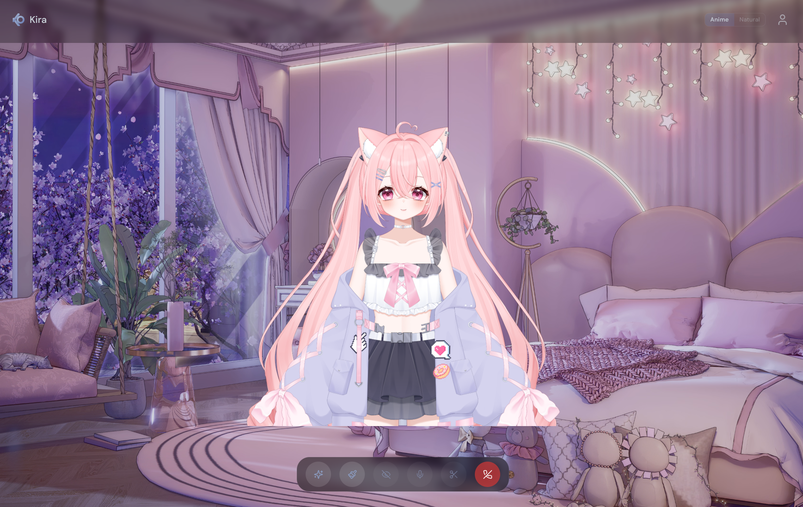

# Kira

<p align="center">
  
</p>

<p align="center">
  <strong>Not an assistant. A presence.</strong><br />
  Real-time voice companion with persistent memory, a Live2D avatar, and a personality that actually has opinions.
</p>

<p align="center">
  <a href="https://www.xoxokira.com">Try it live →</a>
</p>

---

## What This Is

Kira is a voice-first AI companion you talk to like a person. She listens through your microphone, responds with her own voice, remembers your conversations across sessions, and builds a relationship with you over time.

She has a Live2D avatar that reacts emotionally to what she's saying. She can see your screen or your camera. She teases you, has strong opinions about anime, and will remember that you were stressed about that interview three weeks ago and ask how it went.

Everything is engineered for natural conversation — the first audio plays in under 1.5 seconds, her expressions shift mid-sentence, and she knows when you're pausing to think versus when you've finished talking.

**Live:** [xoxokira.com](https://www.xoxokira.com)

---

## Core Systems

### Voice Pipeline

Audio streams from the browser microphone through an AudioWorklet, across a WebSocket to the server, where Deepgram transcribes it in real-time. An adaptive silence detector determines end-of-utterance — short phrases like "yes" get a 500ms cutoff for snappy responses, while long multi-part questions get up to 1500ms of patience. The transcript routes to Groq's Llama 3.3 70B (streaming), which pipes sentence-by-sentence into Azure TTS. The first sentence of audio arrives at the client while the third sentence is still being written. When vision is active (screen share or camera), the pipeline falls back to OpenAI GPT-4o for multimodal support.

**Latency benchmarks (production):**

| Metric | Result |
|---|---|
| End-to-end average | 1,450ms |
| End-to-end best | 1,003ms |
| LLM first token | 300–1,000ms |
| TTS first audio | ~550ms |
| Context compression stalls | 0ms (non-blocking) |

### Live2D Avatar

Kira has a full Live2D model with 15 emotion states driven by inline LLM expression tags: neutral, happy, excited, love, blush, sad, angry, playful, thinking, speechless, eyeroll, sleepy, frustrated, confused, and surprised. The LLM prefixes every response with an `[EMO:emotion]` tag — parsed from the first streamed tokens and sent to the client before TTS finishes, so her expression shifts as she starts speaking. Optional action and accessory tags (`[EMO:emotion|ACT:action|ACC:accessory]`) trigger contextual animations like holding a phone, gaming, or putting on headphones.

A **comfort arc system** drives timed accessory changes as the conversation progresses — jacket comes off at 1 minute, bangs get clipped at 3.5 minutes, earbuds go in at 7.5 minutes. Late night sessions (10pm–4am) start with the jacket already off. Accessories persist through emotion changes and expression resets.

The avatar supports scroll-wheel zoom (desktop) and pinch-to-zoom (mobile) from 1.0x to 2.0x, with automatic Y-offset adjustment to keep the face centered. Falls back to an audio-reactive orb on devices where WebGL fails.

### Scene Background

An animated scene mode renders a looping video background behind the avatar with a frosted glass control bar overlay. The Live2D canvas is fully transparent so the character composites naturally over the scene. Controls and header adapt with backdrop blur and semi-transparent overlays when the scene is active.

### Clip & Share

A rolling 30-second MediaRecorder buffer captures the avatar canvas composited with the scene background video and Kira's audio output. Users can save a clip of the last 30 seconds at any time — download as MP4 or share directly via the Web Share API on mobile. The composite canvas renders both the background video and the Live2D avatar at 30fps using `requestAnimationFrame`.

### Memory

Memory operates on two layers:

**Layer 1 — In-conversation.** A rolling summary compresses older messages in the background without blocking the response pipeline. When chat history exceeds 20 messages, the 6 oldest are spliced out immediately and summarized asynchronously via a fire-and-forget background call. A 20-minute conversation retains full context from the first minute.

**Layer 2 — Cross-session.** On disconnect, an extraction pipeline sends the conversation to GPT-4o-mini and stores structured facts in a `MemoryFact` table across 7 categories — identity, preferences, relationships, emotional patterns, shared experiences, life context, and opinions — each weighted by emotional significance (0.0–1.0). On reconnect, the top 30 facts by weight are loaded into context with natural-language framing so Kira references them like a friend, not a database.

**Deduplication** uses topic-aware matching. New facts are compared against existing ones using meaningful keyword overlap (filtering out structural and generic words) and topic category detection (anime, music, games, food, etc.). A fact about a user's favorite anime won't accidentally replace a fact about their favorite food just because both contain the word "favorite."

### Vision

Kira can see the user's world through two modes:

**Screen share (desktop):** Captured via `getDisplayMedia`, downscaled to 512px, and sent as JPEG snapshots. A scene-change detection system with a rolling temporal buffer means Kira receives not just the current frame but a timeline of recent changes — so she can react to what just happened, not just what's on screen now.

**Camera (mobile):** Rear or front camera captured via `getUserMedia` with a tap-to-flip control and a draggable PIP preview. Same snapshot pipeline as screen share.

Both modes send periodic captures every 15 seconds plus speech-triggered snapshots when the user starts talking. Up to 3 frames are sent per LLM call for temporal context. Vision requests fall back from Groq to OpenAI GPT-4o for multimodal support. An independent reaction timer fires every 75–120 seconds so Kira comments on what she sees unprompted — short reactions under 15 words, like a friend watching alongside you.

### Dual Voice System

Two Azure TTS voice configurations switchable mid-conversation:

- **Anime** — Higher pitch, faster rate, expressive style. Default.
- **Natural** — Softer, slower, conversational tone with configurable style parameters.

### Conversation Behavior

**Silence-initiated turns.** After 25 seconds of quiet (and at least 2 turns of conversation), Kira may speak unprompted — bringing up a thought, referencing a memory, or continuing a thread. She gets one unprompted turn, then waits for the user to respond before initiating again.

**Opener variety.** Each conversation starts with a contextual greeting based on user type (new guest, returning guest, free user, pro user) and loaded memories. The opener prompt explicitly rotates topics and avoids referencing the same memory every session.

**Graceful time limits.** When time runs low, the system enters a goodbye phase where Kira's next response is constrained to a warm 1-sentence farewell referencing something from the conversation. If the user doesn't speak, a proactive goodbye fires after 3 seconds.

**State machine safety.** A 30-second timeout forces the pipeline back to `listening` if it gets stuck in `thinking` or `speaking`. Any end-of-utterance messages received during a stuck state are queued and re-injected when the state recovers.

---

## Architecture

```
Browser (Next.js + Live2D)              Server (Node.js + WebSocket)
──────────────────────────              ────────────────────────────
Microphone                              WebSocket Handler
  → AudioWorklet (16kHz PCM)              → Auth (Clerk JWT / Guest ID)
  → Client-side VAD                       → Rate Limiting (control + LLM)
  → Adaptive EOU Timer                    → Deepgram STT (streaming)
  → WebSocket ──────────────────────────→ → Transcript Buffer
                                          → Groq Llama 3.3 70B (streaming)
Live2D Avatar                             → OpenAI GPT-4o (vision fallback)
  → 15 Emotion States                    → Sentence Splitter
  → Action + Accessory Tags              → Azure TTS (SSML streaming)
  → Comfort Arc Accessories               → Inline Emotion Tags ([EMO:...])
  → Zoom (scroll / pinch)                → Expression + Accessory Events
                                          → State Machine (listening/thinking/speaking)
Scene Background
  → Animated video loop                  Memory System
  → Frosted glass overlay                → L1: Rolling in-conversation summary
                                          → L2: Post-disconnect fact extraction (GPT-4o-mini)
Screen Share / Camera                     → MemoryFact table (7 categories)
  → Scene Detection + Diffing            → Topic-aware deduplication
  → Periodic + Speech-triggered
  → 3 frames per LLM call               Subscription Self-Healing
  ──────────────────────────────────────→ → DB-cached tier check
                                          → Stripe API fallback on mismatch
  ←──── audio + state + expressions ←──
                                        PostgreSQL (Prisma ORM)
Audio Playback Queue                      → Users, Conversations, Messages
  → Scheduled back-to-back               → MemoryFacts (weighted)
  → Analyser node → avatar lip sync      → MonthlyUsage, GuestUsage
  → Speaker

Clip Recorder
  → Rolling 30s MediaRecorder buffer
  → Composite canvas (avatar + scene)
  → MP4 download / Web Share API
```

---

## User Tiers

| | Guest | Free (signed in) | Pro — $9.99/mo |
|---|---|---|---|
| Real-time voice | ✓ | ✓ | ✓ |
| Live2D avatar + expressions | ✓ | ✓ | ✓ |
| Vision (screen share / camera) | ✓ | ✓ | ✓ |
| In-conversation memory | ✓ | ✓ | ✓ |
| Cross-session memory | — | ✓ | ✓ |
| Conversation history | — | ✓ | ✓ |
| Daily limit | 15 min | 15 min | 40 hrs/mo |

Guest conversations are buffered in-memory for 24 hours. Returning guests get their recent history loaded for continuity. If a guest creates an account, their conversation and extracted memories are automatically migrated via a Clerk webhook.

---

## Tech Stack

| Layer | Technology |
|---|---|
| Frontend | Next.js 14, React 18, Tailwind CSS |
| Avatar | Live2D (pixi-live2d-display + PixiJS 7) |
| Voice Server | Node.js, ws, custom streaming pipeline |
| Speech-to-Text | Deepgram (live WebSocket, self-healing reconnect) |
| Language Model | Groq Llama 3.3 70B (conversation), OpenAI GPT-4o (vision), GPT-4o-mini (memory extraction) |
| Text-to-Speech | Azure Cognitive Services (per-sentence SSML, dual voice) |
| Vision | getDisplayMedia / getUserMedia → canvas → scene diffing |
| Clip Recording | MediaRecorder + composite canvas → MP4 / Web Share API |
| Auth | Clerk (JWT verification, webhooks) |
| Billing | Stripe (checkout, portal, subscription webhooks) |
| Database | PostgreSQL + Prisma ORM |
| Hosting | Vercel (web) + Render (voice server) |

---

## Project Structure

```
Kira_App/
├── packages/
│   ├── web/                              # Next.js frontend (Vercel)
│   │   ├── src/
│   │   │   ├── app/
│   │   │   │   ├── api/
│   │   │   │   │   ├── stripe/              # Checkout + billing portal
│   │   │   │   │   ├── webhooks/            # Stripe + Clerk webhook handlers
│   │   │   │   │   ├── conversations/       # Conversation history API
│   │   │   │   │   └── user/                # Account deletion
│   │   │   │   └── (chat)/
│   │   │   │       └── chat/[conversationId]/
│   │   │   │           └── ChatClient.tsx    # Main chat UI + scene + clip controls
│   │   │   ├── components/
│   │   │   │   ├── Live2DAvatar.tsx          # Avatar rendering + expressions
│   │   │   │   ├── ChibiLoader.tsx          # Chibi loading screen
│   │   │   │   ├── KiraOrb.tsx              # Fallback audio visualizer
│   │   │   │   └── ProfileModal.tsx
│   │   │   ├── hooks/
│   │   │   │   ├── useKiraSocket.ts         # WebSocket + VAD + adaptive EOU
│   │   │   │   ├── useClipRecorder.ts       # Rolling 30s clip buffer + share
│   │   │   │   ├── useSceneDetection.ts     # Screen share scene diffing
│   │   │   │   └── use-subscription.ts      # Stripe subscription check
│   │   │   └── lib/
│   │   │       ├── prisma.ts                # Singleton Prisma client
│   │   │       ├── stripe.ts                # Stripe client init
│   │   │       ├── guestId.ts               # localStorage guest ID
│   │   │       └── voicePreference.ts       # Voice selection persistence
│   │   ├── public/
│   │   │   └── worklets/
│   │   │       ├── AudioWorkletProcessor.js
│   │   │       └── models/
│   │   │           ├── Kira/                # Live2D model assets
│   │   │           └── Suki/               # Scene videos + chibi art
│   │   ├── middleware.ts                    # Clerk auth middleware
│   │   └── next.config.js                   # Security headers
│   │
│   └── server/                           # Real-time voice server (Render)
│       └── src/
│           ├── server.ts                    # Pipeline orchestration + state machine
│           ├── personality.ts               # Kira's character system prompt
│           ├── memoryExtractor.ts           # Post-conversation fact extraction
│           ├── memoryLoader.ts              # Memory loading on connect
│           ├── guestMemoryBuffer.ts         # Guest conversation continuity
│           ├── guestUsage.ts                # Guest daily usage (Prisma)
│           ├── proUsage.ts                  # Pro monthly usage (Prisma)
│           ├── prismaClient.ts              # Shared Prisma instance
│           ├── DeepgramSTTStreamer.ts        # STT with self-healing reconnect
│           └── AzureTTSStreamer.ts           # SSML synthesis (dual voice)
│
├── prisma/
│   └── schema.prisma                        # User, Conversation, Message,
│                                            # MemoryFact, MonthlyUsage, GuestUsage
└── render.yaml                              # Render deployment config
```

---

## Run Locally

```bash
git clone https://github.com/JonathanDunkleberger/Kira_App.git
cd Kira_App
pnpm install
```

Copy `.env.example` to `.env` in both `packages/web/` and `packages/server/`. Required keys:

```
# Server
CLERK_SECRET_KEY, OPENAI_API_KEY, GROQ_API_KEY,
DEEPGRAM_API_KEY, AZURE_SPEECH_KEY, AZURE_SPEECH_REGION,
STRIPE_SECRET_KEY, INTERNAL_API_SECRET, DATABASE_URL

# Web
NEXT_PUBLIC_APP_URL, NEXT_PUBLIC_WEBSOCKET_URL,
STRIPE_SECRET_KEY, STRIPE_PRICE_ID, STRIPE_WEBHOOK_SECRET,
CLERK_WEBHOOK_SECRET
```

```bash
pnpm dev:web      # localhost:3000
pnpm dev:server   # ws://localhost:10000
```

See [`DEPLOYMENT.md`](./DEPLOYMENT.md) for Vercel + Render deployment.

---

## Security

The application has been through a comprehensive security audit covering authentication, WebSocket hardening, payment flow, and infrastructure. Key measures include:

- Clerk JWT verification on all WebSocket connections with guest ID format validation
- WebSocket origin allowlist and 5MB max payload
- Per-connection LLM call rate limiting and control message throttling
- Per-IP connection limits
- Stripe webhook signature verification with subscription lifecycle handling
- CSRF protection on payment routes
- Security headers (X-Frame-Options, CSP, HSTS via hosting)
- No API keys or secrets exposed to the client

---

## License

MIT — see [LICENSE](./LICENSE).
